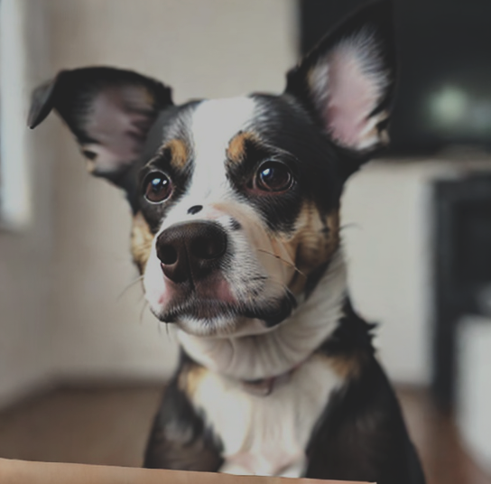
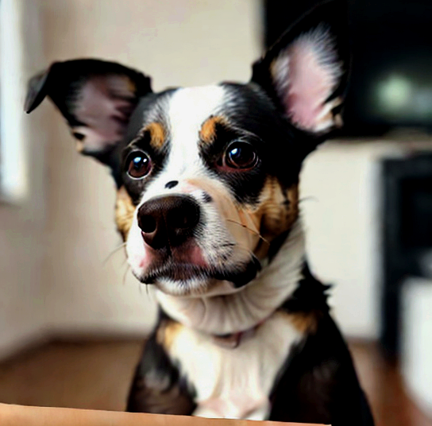
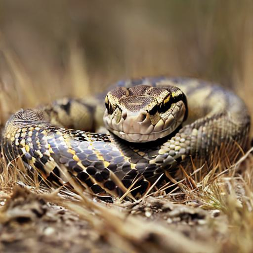
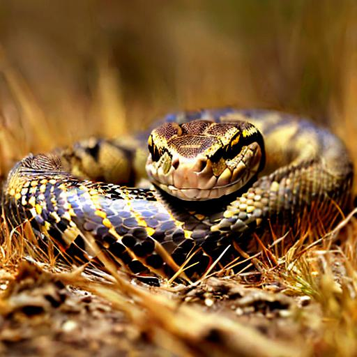
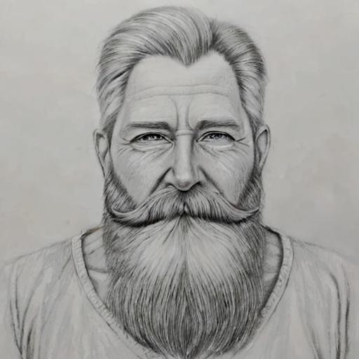

# The Non-Ultimate Image Enhancer 🐌
An algorithm based on decision trees and deep learning models to enhance images.  
The algorithm is simple, it does not always provide good results on already great images.  
The default maximum runtime is 60 seconds / image. The algorithm can provide good results in 10 seconds on some images.  
The algorithm tries multiple transformations on contrast / saturation / lighting etc., it evaluates the changes and keeps the best ones. 

## Results
  Enhanced ✔️

  Enhanced ✔️

  Enhanced ❓


## Requirements

- A GPU with > 2GB VRAM (very slow on CPU)
- [CLIP](https://github.com/openai/CLIP)

## Usage

```bash
python3 enhance_image.py examples/1.png --maxruntime=10
```
or

- Available sd-webui extension: https://github.com/Whiax/sd-webui-nulienhance 

## Models

- [Aesthetic predictor](https://github.com/christophschuhmann/improved-aesthetic-predictor): [github.com/christophschuhmann/improved-aesthetic-predictor](https://github.com/christophschuhmann/improved-aesthetic-predictor)
- [CLIP](https://github.com/openai/CLIP): [github.com/openai/CLIP](https://github.com/openai/CLIP)

